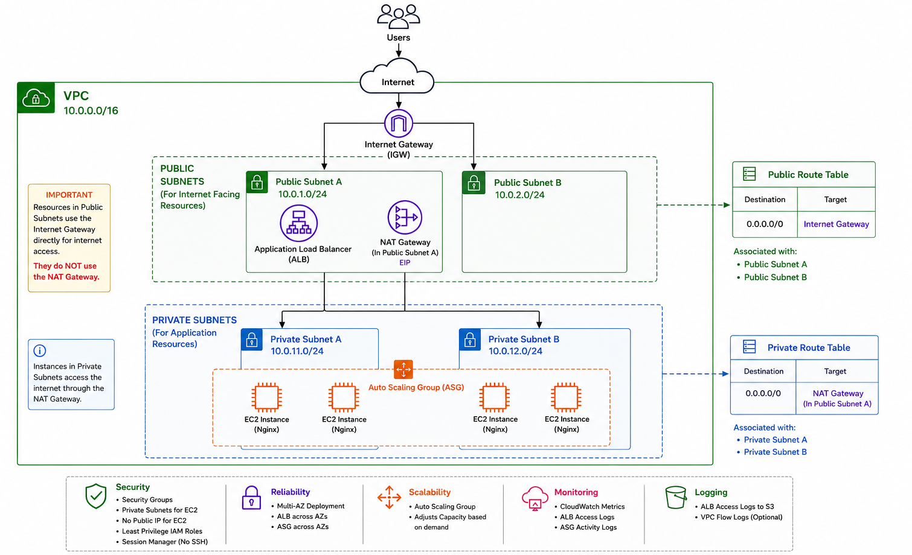
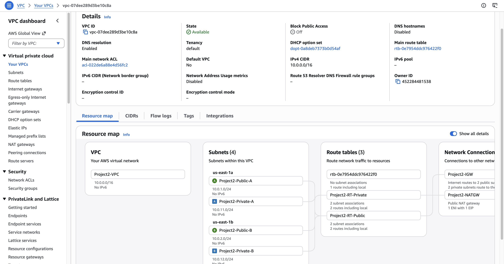
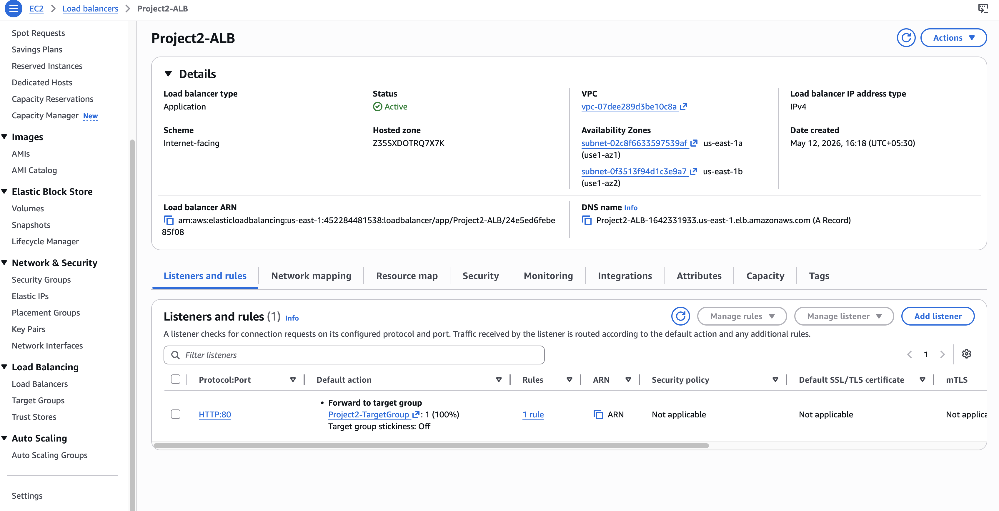
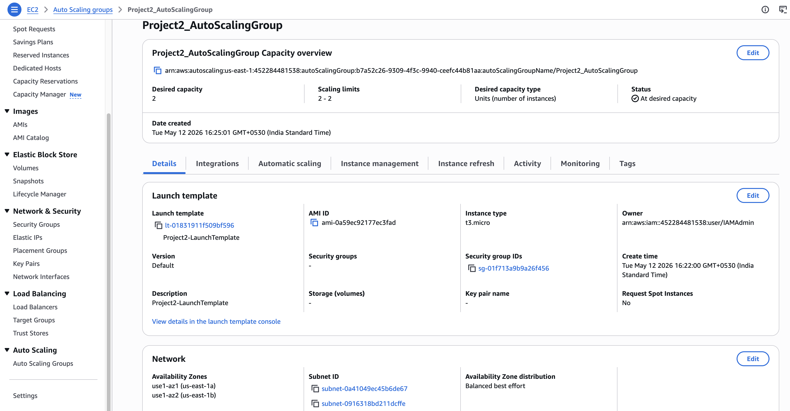
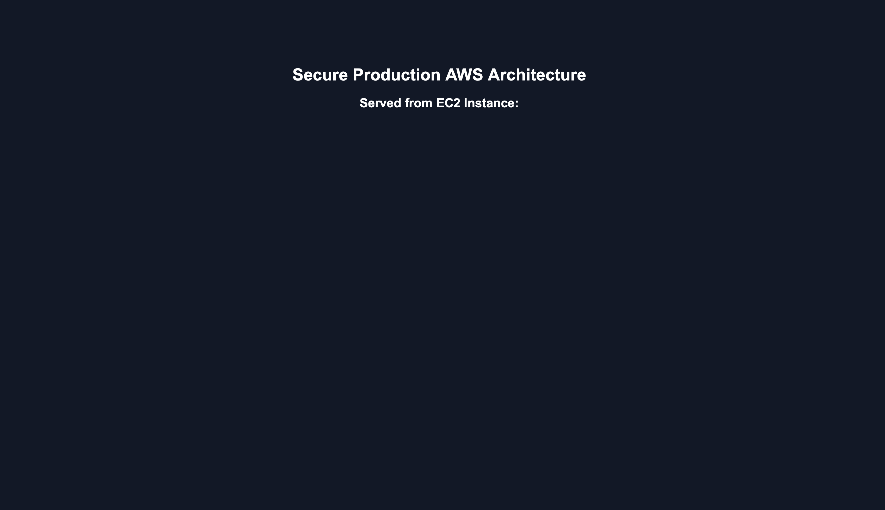

# AWS Secure High Availability Nginx Architecture

## Project Overview

This project demonstrates a production-style AWS architecture for hosting a highly available and secure static web application using Nginx on EC2 instances behind an Application Load Balancer with Auto Scaling.

The infrastructure follows AWS security best practices including:

- Private EC2 instances
- Public-facing Application Load Balancer
- Auto Scaling Group across multiple Availability Zones
- IAM Roles instead of access keys
- Session Manager instead of SSH
- Security Group based access control
- NAT Gateway for controlled outbound internet access

---

# Architecture

## Components Used

- VPC
- Public and Private Subnets
- Internet Gateway
- NAT Gateway
- Route Tables
- EC2 Instances
- Nginx
- Launch Template
- Auto Scaling Group
- Application Load Balancer
- IAM Roles
- CloudWatch
- Systems Manager Session Manager

---

# Architecture Diagram



---

# High Level Architecture

User
↓
Application Load Balancer
↓
Auto Scaling Group
↓
EC2 Instances (Private Subnets)
↓
Nginx Static Website

---

# Security Features Implemented

## Network Security
- EC2 instances deployed in private subnets
- No public IP addresses assigned to EC2
- Internet access controlled via NAT Gateway
- Security Groups restrict traffic flow

## Access Management
- IAM Role attached to EC2 instances
- No hardcoded AWS credentials
- Session Manager used instead of SSH

## High Availability
- Multi-AZ deployment
- Load balancing using ALB
- Auto Scaling Group ensures desired capacity

## Monitoring
- Health checks configured on Target Group
- CloudWatch metrics enabled

---

# Auto Scaling Configuration

| Setting | Value |
|---|---|
| Desired Capacity | 2 |
| Minimum Capacity | 2 |
| Maximum Capacity | 4 |

---

# Load Balancer Configuration

| Setting | Value |
|---|---|
| Type | Application Load Balancer |
| Scheme | Internet Facing |
| Listener | HTTP : 80 |
| Target Type | Instance |

---

# EC2 Configuration

| Setting | Value |
|---|---|
| OS | Amazon Linux 2023 |
| Web Server | Nginx |
| Access Method | AWS Systems Manager |

---

# User Data Script

```bash
#!/bin/bash

dnf update -y
dnf install nginx -y

systemctl enable nginx
systemctl start nginx

INSTANCE_ID=$(curl -s http://169.254.169.254/latest/meta-data/instance-id)

cat <<EOF > /usr/share/nginx/html/index.html
<!DOCTYPE html>
<html>
<head>
<title>AWS Production Project</title>
<style>
body {
  font-family: Arial;
  text-align: center;
  padding-top: 100px;
  background-color: #111827;
  color: white;
}
</style>
</head>
<body>
<h1>Secure AWS HA Architecture</h1>
<h2>Served from EC2 Instance:</h2>
<h3>$INSTANCE_ID</h3>
</body>
</html>
EOF
```

---

# Project Objectives

- Build secure AWS infrastructure
- Implement high availability architecture
- Understand VPC networking
- Learn ALB and Auto Scaling
- Implement production-grade security controls
- Practice infrastructure troubleshooting

---

# Future Improvements

- Add HTTPS using ACM
- Add CloudFront CDN
- Add AWS WAF
- Terraform automation
- CI/CD pipeline
- Containerize application using Docker
- ECS or EKS migration

---

# Key Learnings

- VPC design and subnetting
- AWS networking concepts
- Secure EC2 deployment
- Auto Scaling concepts
- Load balancing
- IAM best practices
- Session Manager access
- CloudWatch monitoring

---

# Screenshots

## VPC


## Application Load Balancer


## Auto Scaling Group


## Nginx Webpage


---

# Author

Rajesh Tyson

Cloud Security & AWS Learning Project
